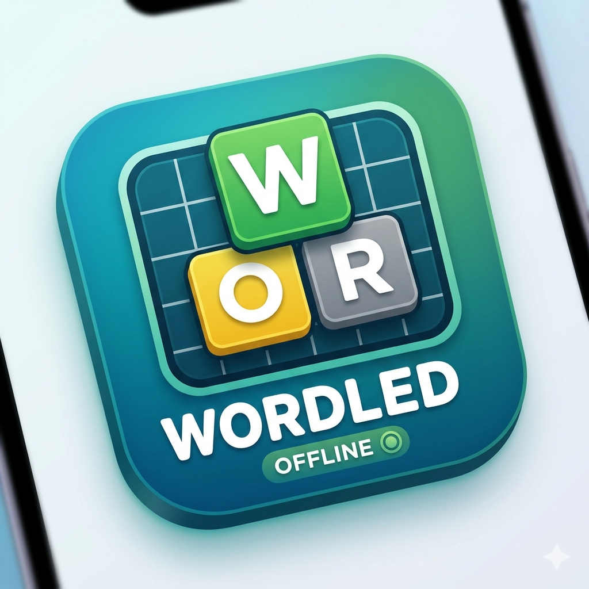

<p align="center">
  
</p>

<h1 align="center">Wordled</h1>

<p align="center">An offline-first <b>Wordle</b> clone built with Flutter — hosted on Vercel, playable in airplane mode once installed.</p>

---

Wordled is a Progressive Web App. Open it once (or "Add to Home Screen") and it
keeps working with **no network at all** — the word lists are bundled and a
custom service worker precaches every asset, so you can play offline.

## Features

- 🎯 **Daily puzzle** — one shared word per day, derived deterministically from
  the date (no server required).
- 🎲 **Practice mode** — endless random words to replay.
- 📐 **Configurable board** — word lengths from **3 to 9 letters** and guess
  counts from **4 to 20**. Each length ships its own bundled dictionary.
- 🎚️ **Difficulty** — Easy (no dictionary check), Normal, or Hard (revealed
  hints must be reused).
- 🎨 **Theming** — System / Light / Dark, five palette presets, plus a **custom
  palette** editor for the correct / present / absent colors.
- ⌨️ On-screen and physical keyboard input with per-key color feedback.
- ✨ Tile flip / pop / shake animations.
- 📊 Per-configuration statistics (each board size tracks its own streaks and
  guess distribution) and emoji result sharing.
- 🛠️ **Update & maintenance center** — verbose diagnostic logging with an
  in-app viewer, version tracking, "check for updates", "clear cache", and a
  **nuclear reset** that obliterates everything and starts fresh.
- 📴 **Fully offline** once loaded.

## How offline works

Two pieces make airplane-mode play possible:

1. **No network logic.** Word lists live as bundled text assets
   (`assets/words/`), and the daily word is computed from the calendar date —
   nothing is fetched at runtime.
2. **A precaching service worker.** Flutter 3.44+ ships a service worker that
   only unregisters itself
   ([flutter#156910](https://github.com/flutter/flutter/issues/156910)), so it
   no longer provides offline caching. `tool/gen_service_worker.js` replaces it
   after each build with an offline-first worker that precaches the app shell,
   `main.dart.js`, the word assets and the local CanvasKit engine. The app is
   built with `--no-web-resources-cdn` so CanvasKit is served same-origin
   instead of from a CDN.

## Project layout

```
lib/
  version.dart            App version (source of truth for update tracking)
  models/
    game.dart             Guess evaluation, hard-mode rules, daily-word logic
    settings.dart         User settings (length, guesses, difficulty, theme…)
    palette.dart          Color palettes (presets + custom)
    stats.dart            Per-configuration statistics
  services/
    word_repository.dart  Lazily loads per-length word lists from assets
    storage.dart          shared_preferences persistence (per-config scoped)
    update_service.dart    Service-worker / cache / version control (web)
    logger.dart           Verbose logger with in-memory buffer
  screens/
    game_screen.dart      Board, keyboard, drawer, app bar
    settings_screen.dart  All customization + maintenance actions
    how_to_play.dart      Styled help sheet
    log_viewer.dart       Diagnostic log viewer
  widgets/                Board, keyboard, stats dialog, color picker
assets/
  words/                  answers_N.txt / allowed_N.txt for N = 3..9
  icon/wordled_icon.png   App icon (also the source for PWA icons)
tool/
  gen_service_worker.js   Post-build offline service-worker generator
  vercel_build.sh         Vercel build script
web/                      PWA manifest, index.html with splash, generated icons
vercel.json               Vercel build + caching configuration
RELEASE_NOTES.md          Running changelog
```

## Running locally

Requires the [Flutter SDK](https://docs.flutter.dev/get-started/install)
(3.44.3 or newer).

```bash
flutter pub get
flutter run -d chrome        # dev
flutter test                 # unit tests for game logic
```

### Building the offline web app

```bash
flutter build web --release --no-web-resources-cdn
node tool/gen_service_worker.js build/web
# serve build/web with any static file server
```

### Regenerating the app icons

The PWA / home-screen icons and favicon are generated from
`assets/icon/wordled_icon.png`:

```bash
dart run flutter_launcher_icons
```

## Deploying to Vercel

The repo is preconfigured. Import it into Vercel (or run `vercel`) and it will:

1. Download the pinned Flutter SDK (`tool/vercel_build.sh`).
2. Run `flutter build web --release --no-web-resources-cdn`.
3. Generate the offline service worker.
4. Serve `build/web` as a static site.

No build artifacts are committed — Vercel builds from source. The Flutter
version can be overridden with the `FLUTTER_VERSION` environment variable.

## Word lists

Answers are common English words (so the daily puzzle stays fair); the larger
allowed-guess sets come from a comprehensive English word list. Both are
bucketed by length into `assets/words/`.

See [RELEASE_NOTES.md](RELEASE_NOTES.md) for the changelog.
